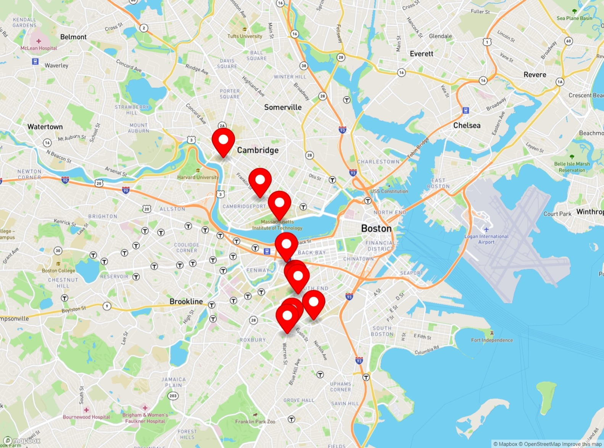

# busestracker

REAL-TIME BUS TRACKER

This is a Real Time Bus Tracker, taking real time updates from the MBTA and showing the current location of the Busses.

It only needs you to run the index.html file on your browser.

This project is part of our learning exercises for MIT's online course for Full Stack Development and it is relatively simply. This could involve real-time updates for the arrival at the next station, a virtual display of the route if the passenger is not sure where is closest to his destination, the passengers inside the bus, and much more to serve the passenger service.

THIS EXERCISE COMPLIES WITH MIT LICENSE.
